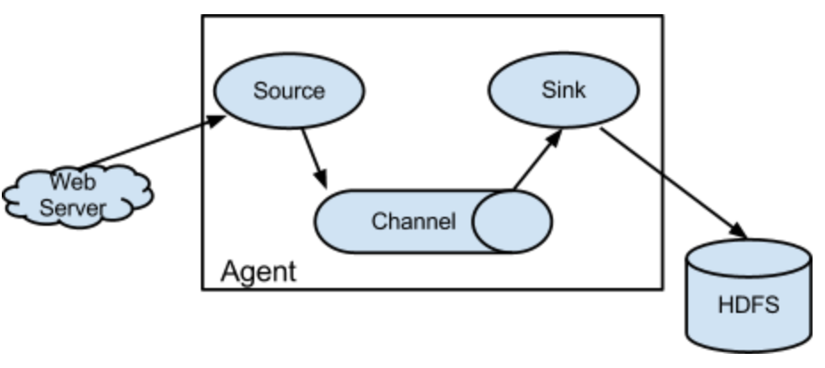
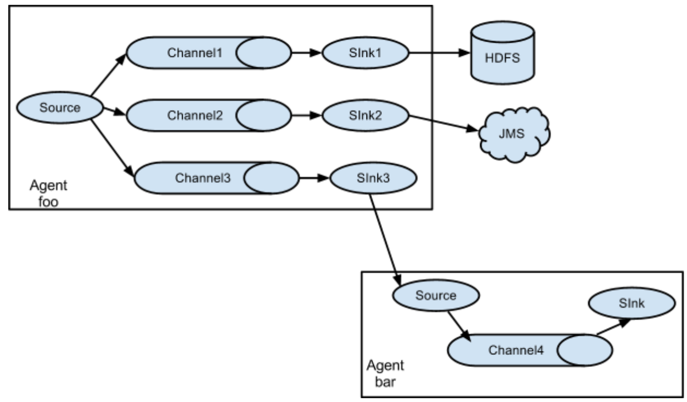

Flume: 文件收集框架，Cloudera开发并开源，实时收集数据，进行流式计算。

网址：http://flume.apache.org

架构图:

名词解释：
  - WebServer: 数据来源，如nginx日志；
  - Source: 对接WebServer获取数据；数据单元：event；
  - Channel: 数据管道：数据安全、容灾、可靠性、恢复，像一个队列；
  - Sink: 从Channel获取event数据，Sink写入HDFS；
  - HDFS: 数据目的端，通过Flume Agent收集、处理数据后落地到目的；

**备注**

    在Source -> Channel 可进行数据清理，Channel -> Source 可进行数据清理。

常用架构：Flume/Kafka + storm/spark

---
## 1、Flume设计架构
Flume是分布式，每个收集的日志文件机器上运行一个Flume Agent，是可靠，高可用的。如果收集过程中出现异常，有对应的处理，自动故障转移。

功能：收集（collecting）、聚集（aggregating）、移动（moving 从源端到目标端）;
基于流式数据进行数据采集，是在线数据分析应用（online analytic application）。

### Event
1. Event是Flume传输的基本数据单元；
2. Flume以事件（Event）的形式将数据从源头传到最终的目的；
3. Event由可选的Header和载有数据的Byte Array(字节数组)构成;
  - 载有的数据对Flume是不透明的；
  - Header包含Key-Value字符串对的无序集合，携带参数、过滤方式等数据；
  - Header可以在上下文路由中使用扩展；

Source ----push event----->  Channel -----poll event---->  Sink

Flume支持一个Event到多个目的端：

